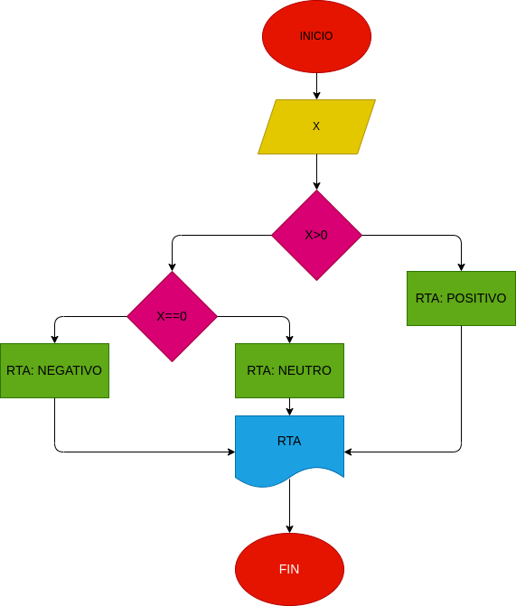

# Positivo---Negativo---Cero

## Programa para identificar si un numero el positivo, negativo, o cero

# ANALISIS

Variables de entrada

X: numero ingresado

Variables de salida

RTA: nos va a decir si es positivo o negativo

# DISEÑO

" CONSTRUCCION